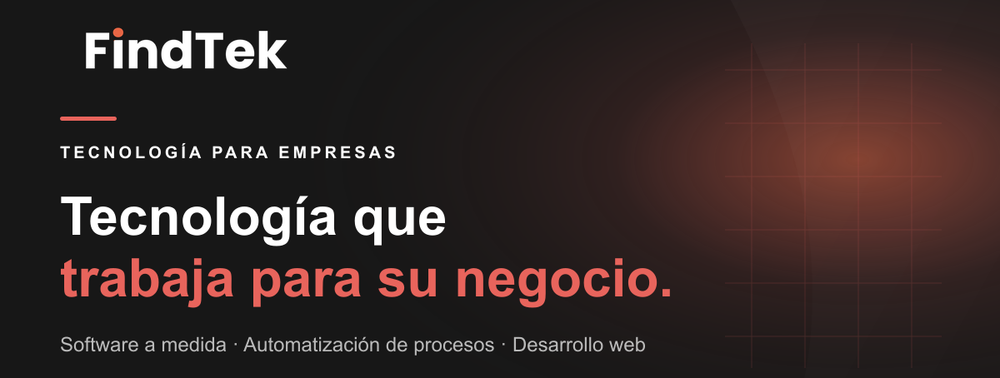
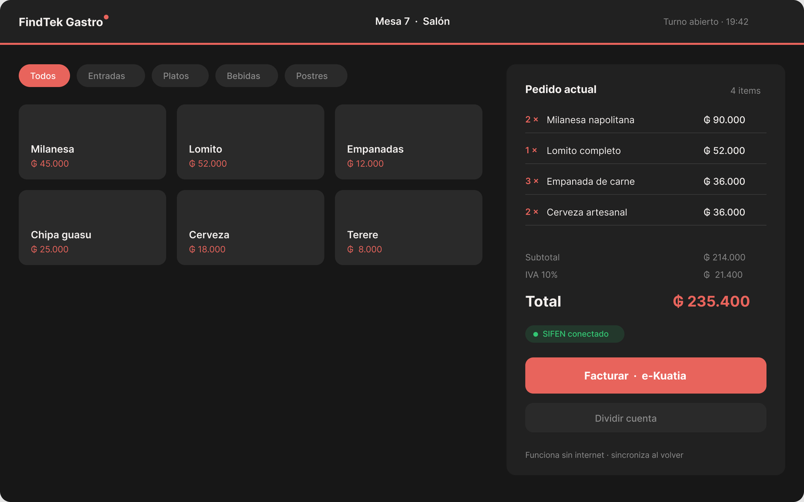
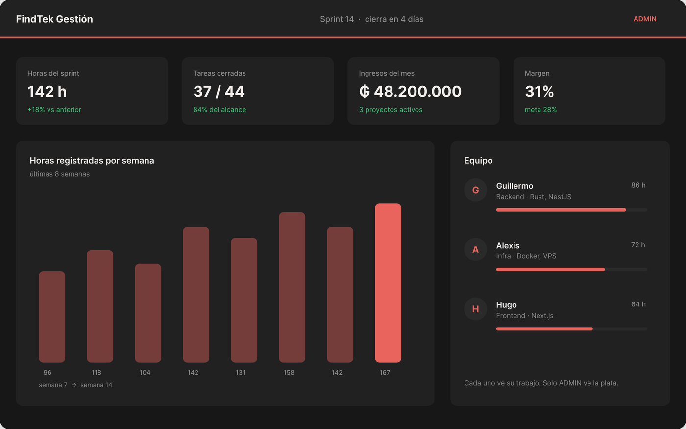
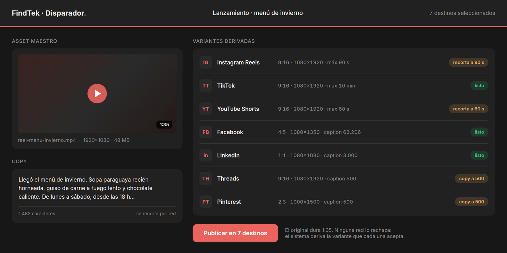
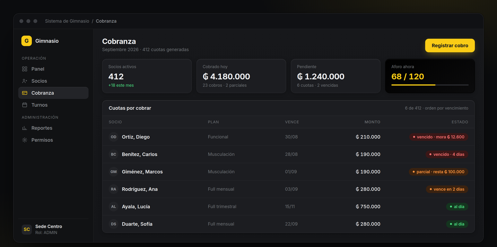

<div align="center">



<br>

**FindTek es una software factory de San Lorenzo, Paraguay.** Somos tres desarrolladores y construimos
sistemas a medida, automatizaciones, páginas web y e-commerce para pymes paraguayas.

<a href="https://www.findtek.com.py/servicios/sistemas-a-medida/">Sistemas a medida</a>
<span>&nbsp;&nbsp;•&nbsp;&nbsp;</span>
<a href="https://www.findtek.com.py/servicios/automatizaciones/">Automatizaciones</a>
<span>&nbsp;&nbsp;•&nbsp;&nbsp;</span>
<a href="https://www.findtek.com.py/servicios/paginas-web/">Páginas web</a>
<span>&nbsp;&nbsp;•&nbsp;&nbsp;</span>
<a href="https://www.findtek.com.py/servicios/ecommerce/">E-commerce</a>

<hr>

<a href="https://www.findtek.com.py"></a>
<a href="https://wa.me/595985244443"></a>
<a href="https://instagram.com/findtekpy"></a>
<a href="mailto:info@findtek.com.py"></a>

<sub>📍 San Lorenzo · Gran Asunción · Paraguay 🇵🇾</sub>

</div>

<br>

## Qué hacemos

| | Servicio | Para qué sirve |
|:--:|---|---|
| 🖥️ | **[Sistemas a medida](https://www.findtek.com.py/servicios/sistemas-a-medida/)** | El software se adapta a cómo ya trabajás, no al revés |
| 🤖 | **[Automatizaciones](https://www.findtek.com.py/servicios/automatizaciones/)** | Sacamos de encima el trabajo repetitivo: reportes, cargas, mensajería |
| 🌐 | **[Páginas web](https://www.findtek.com.py/servicios/paginas-web/)** | Rápidas, indexables y con contenido que editás vos |
| 🛒 | **[E-commerce](https://www.findtek.com.py/servicios/ecommerce/)** | Catálogo, pagos y stock conectados a tu operación real |

<br>

## Cómo trabajamos

> Analizamos cómo trabaja tu empresa, identificamos dónde se pierde tiempo o dinero,
> y diseñamos junto a vos la herramienta que lo resuelve.

```
1 · Analizamos     Miramos tu operación real antes de escribir una línea de código
2 · Arrancás chico  Salimos con lo mínimo que ya te ahorra tiempo, no con el sistema entero
3 · Escalás         Cuando ves el resultado, sumamos el resto — a tu ritmo
```

<br>

## En qué estamos trabajando

<div align="center">








**🎨 Mockups de diseño — no son capturas del producto.**

<sub><b>FindTek Gastro</b>, <b>FindTek Gestión</b>, el <b>Disparador</b> y la <b>gestión para gimnasios</b> están en desarrollo. Estas pantallas
muestran cómo se ven las funciones que ya están especificadas; la interfaz final puede
cambiar. Los datos son de ejemplo.</sub>

</div>

<br>

<table>
<tr>
<td width="50%" valign="top">

### 🍽️ FindTek Gastro
Gestión gastronómica multi-tenant para Paraguay, con **facturación electrónica SIFEN** (e-Kuatia) integrada de fábrica. Funciona sin internet y sincroniza después.

`NestJS` · `React PWA` · `PostgreSQL` · `SIFEN`

</td>
<td width="50%" valign="top">

### 📣 Disparador multiplataforma
Un asset y un copy, una sola pantalla: el sistema deriva la variante correcta para Instagram, TikTok, YouTube Shorts y LinkedIn.

`Rust` · `Axum` · `FFmpeg` · `Next.js`

</td>
</tr>
<tr>
<td width="50%" valign="top">

### 📊 FindTek Gestión
Proyectos, sprints, horas y finanzas del equipo en un solo lugar. Dos roles, permisos reales.

`Next.js` · `Prisma` · `Docker`

</td>
<td width="50%" valign="top">

### 🎯 Prospección local
Negocios paraguayos sin presencia web, segmentados por ciudad y rubro, con seguimiento del embudo y cuota diaria de contactos.

`Next.js` · `PostgreSQL`

</td>
</tr>
<tr>
<td width="50%" valign="top">

### 🏋️ Gestión para gimnasios
SaaS multi-tenant: socios, planes y suscripciones con historial, generación automática de cuotas, cobro con mora y descuento, caja con arqueo, y un motor de permisos de dos capas con bitácora.

`Fastify` · `Prisma` · `Next.js` · `PWA`

</td>
<td width="50%" valign="top">

### 🖥️ Infraestructura propia
No solo escribimos el software: lo operamos. Monitoreo, backups y alertas sobre nuestra propia VPS, con la configuración versionada y **116 checks** que la verifican.

`Docker` · `Grafana` · `Nginx` · `Ubuntu`

</td>
</tr>
</table>

> Son desarrollos propios, por ahora en repos privados. Si te sirve alguno para tu negocio, escribinos.

<br>

## Código abierto

Lo que resolvemos para nuestros proyectos y le sirve a cualquier dev paraguayo, lo publicamos.

<table>
<tr>
<td width="50%" valign="top">

### 📇 [ruc-paraguay](https://github.com/FindTek/ruc-paraguay)
Validación del **RUC paraguayo** sin llamar a la DNIT. Verificado contra **1.995.012 RUC reales** del padrón completo: ninguno vigente falla.

```bash
npm i @findtek/ruc-paraguay
```

</td>
<td width="50%" valign="top">

### 🧾 [sifen-cdc](https://github.com/FindTek/sifen-cdc)
El **CDC de SIFEN** (e-Kuatia): composición, validación y formato KuDE. Verificado contra el ejemplo oficial del **Manual Técnico v150**.

```bash
npm i sifen-cdc
```

</td>
</tr>
</table>

<br>

## Con qué construimos

<div align="center">


</div>

<br>

---

<div align="center">

### ¿Tenés un proceso que te está comiendo el día?

Contanos cómo trabajás hoy y te decimos qué se puede automatizar. Sin costo.

[](https://wa.me/595985244443)
&nbsp;
[](https://www.findtek.com.py)

<br><br>

<sub>FindTek · San Lorenzo, Paraguay · <a href="https://www.findtek.com.py">findtek.com.py</a></sub>

</div>
